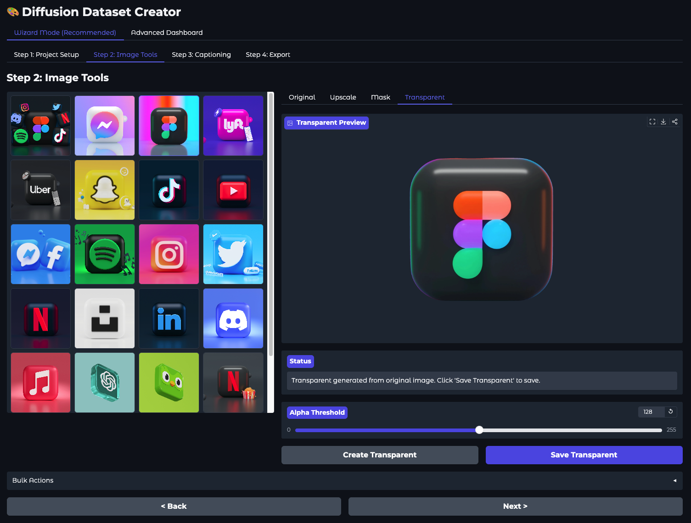
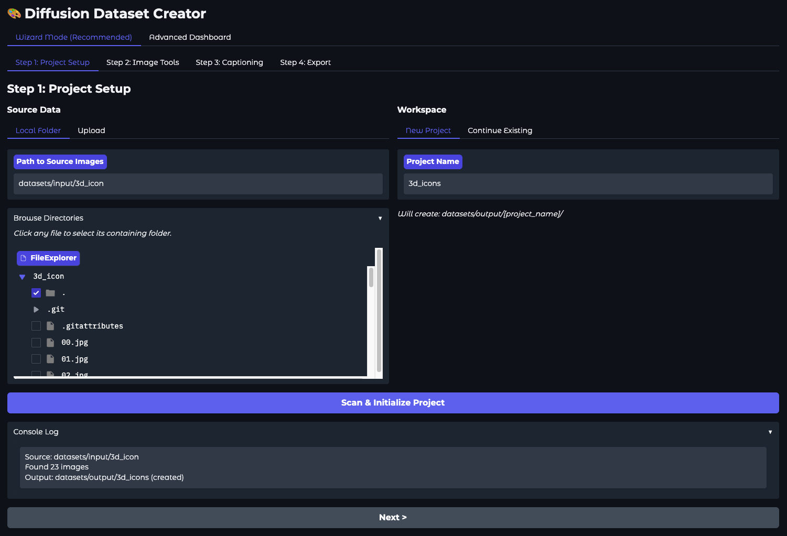
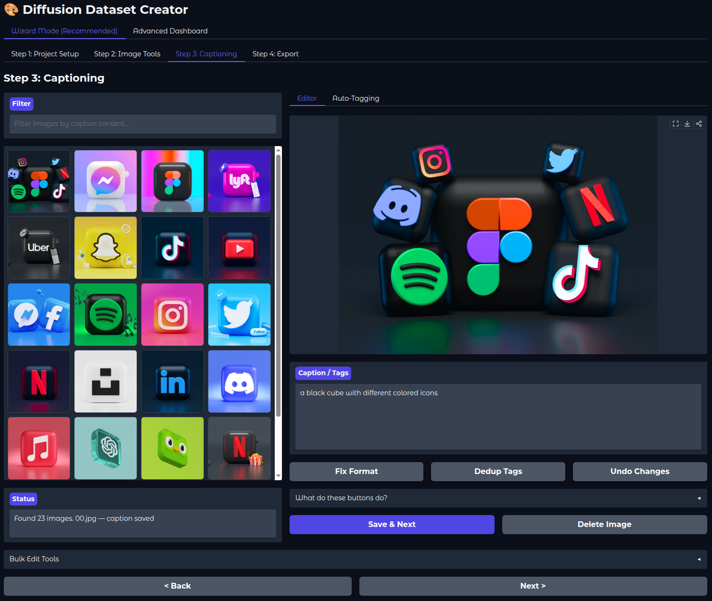
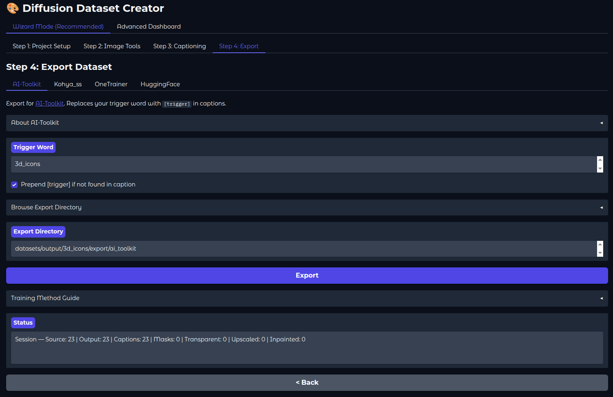

# Diffusion Dataset Creator

A local, GPU-accelerated tool for creating high-quality training datasets for diffusion models (FLUX.1, SDXL, SD 1.5, etc.).



## Features

- **Image Upscaling** - Spandrel-based upscaling (supports ESRGAN, Real-ESRGAN, SwinIR, DAT, and more) for enhancing low-resolution source images
- **Inpainting** - Remove watermarks, text, and artifacts with LaMa or Stable Diffusion inpainting
  - Manual rectangle masks, MobileSAM click-to-segment, and watermark preset regions
  - LaMa (fast, automatic), SD 1.5, or SDXL (prompt-guided) backends
- **Smart Crop** - Face-centric training crops (face_focus, upper_body, full_body) with automatic face detection
- **Background Removal** - BiRefNet-powered automatic mask generation and transparency
  - Processes individual images or all smart crops in batch
- **Auto-Captioning** - Multiple model options:
  - Qwen2.5-VL (3B / 7B 4-bit / 7B 8-bit) - Vision-language model captions
  - BLIP (Base/Large) - Lightweight natural language captions
  - JoyCaption - High-quality descriptive captions (BF16 or 8-bit quantized)
  - WD14 Taggers (ONNX) - Booru-style tags via ViT, ConvNext, or SwinV2
- **Export & Push to Hub** - Export to Kohya_ss, AI-Toolkit, OneTrainer, or HuggingFace formats, and push directly to the HuggingFace Hub
- **Non-Destructive Workflow** - Separate input/output directories preserve originals
- **Local Processing** - Runs entirely on your machine, no cloud dependencies

## Screenshots

| Import | Image Tools | Captioning | Export |
|--------|-------------|------------|--------|
|  |  |  |  |

## Requirements

- Python 3.10+
- NVIDIA GPU with CUDA (recommended)
- [uv](https://github.com/astral-sh/uv) package manager

### GPU Memory Requirements

| Model | VRAM |
|-------|------|
| BLIP | ~1GB |
| Qwen2.5-VL 3B | ~10GB |
| Qwen2.5-VL 7B (4-bit) | ~9GB |
| Qwen2.5-VL 7B (8-bit) | ~12GB |
| JoyCaption (BF16) | ~14GB (requires 16GB+ GPU) |
| JoyCaption (8-bit) | ~10GB (requires 12GB+ GPU) |
| WD14 ONNX | ~1GB |
| BiRefNet | ~4GB |
| Spandrel Upscaler | ~2-4GB |
| MobileSAM | ~1GB |
| LaMa Inpainting | ~2GB |
| SD 1.5 Inpainting | ~6GB |
| SDXL Inpainting | ~10GB |

## Installation

```bash
# Clone the repository
git clone https://github.com/yourusername/dd-creator.git
cd dd-creator

# Run (uv auto-creates venv and installs dependencies)
uv run app.py
```

Open your browser to `http://127.0.0.1:7860`

### Upscaler Models

Place upscaler `.pth` or `.safetensors` model files in the `models/` directory. Popular options:
- [RealESRGAN_x4plus](https://github.com/xinntao/Real-ESRGAN)
- [4x-UltraSharp](https://openmodeldb.info/models/4x-UltraSharp)

## Usage

The wizard guides you through 4 steps:

1. **Project Setup** - Configure source data (local folder or browser upload) and workspace (new project or continue existing). Scans for existing caption files in both source and output directories so you can pick up where you left off.
2. **Image Tools** - Per-image editing (resize, upscale, inpaint, smart crop, masks, transparency) or bulk processing with smart resize/upscale routing
3. **Captioning** - Generate and edit captions with powerful tools:
   - Batch generation with prefix/suffix tags (trigger words, quality tags)
   - Automatic Danbooru rating tag filtering (optional, on by default)
   - Source caption import: existing captions from your source folder appear for review
   - Search/filter images by caption content
   - Hygiene tools: fix formatting, deduplicate tags, undo changes
   - Bulk operations: add/remove tags, search & replace across all captions
   - Validation: ensures all images have saved captions before proceeding
4. **Export** - Review session stats and export to Kohya_ss, AI-Toolkit, OneTrainer, or HuggingFace formats. Optionally push directly to the HuggingFace Hub

## Project Structure

```
dd-creator/
├── app.py                 # Gradio application entry point
├── src/
│   ├── core/
│   │   ├── state.py       # Project state management
│   │   ├── captioning.py  # VLM/tagger model wrappers
│   │   ├── segmentation.py # BiRefNet background removal
│   │   ├── upscaling.py   # Spandrel upscaling
│   │   ├── inpainting.py  # LaMa + SD inpainting backends
│   │   ├── sam_segmenter.py # MobileSAM click-to-segment
│   │   ├── smart_crop.py  # Face-centric training crops
│   │   └── export.py      # Export formats + HuggingFace Hub push
│   └── ui/
│       ├── wizard.py      # 4-step guided workflow
│       └── dashboard.py   # Advanced tools (WIP)
├── models/                # User-provided upscaler models
└── assets/                # README screenshots
```

## Development

```bash
# Run with auto-reload (if using gradio dev mode)
uv run gradio app.py
```

## License

MIT
